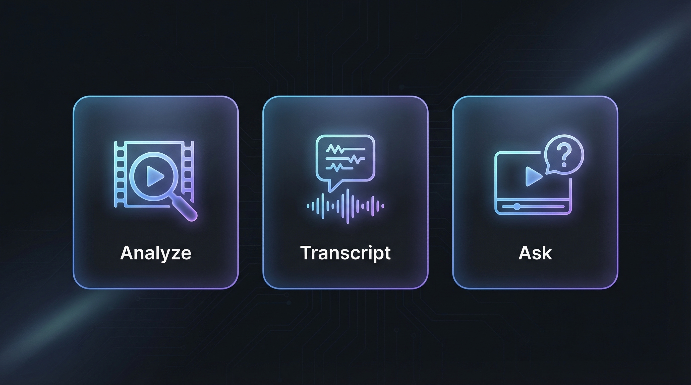
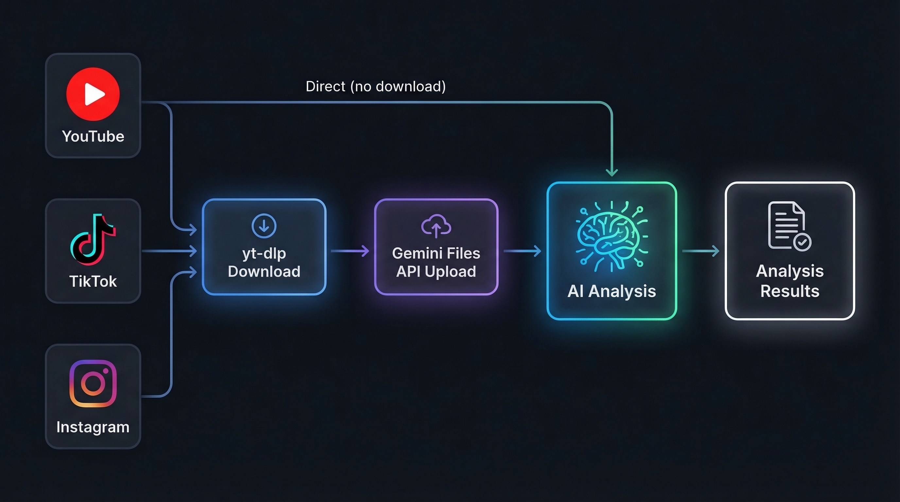

<!-- Banner image -->
<!-- mcp-name: io.github.u2n4/video-url-analyzer-mcp -->
<div align="center">
  

  <h1>Video URL Analyzer MCP</h1>
  <p><strong>MCP server to analyze YouTube, TikTok &amp; Instagram videos from URL — transcripts, AI insights, tutorial extraction</strong></p>

  <p>
    <a href="https://pypi.org/project/video-url-analyzer-mcp/"></a>
    <a href="#"></a>
    <a href="LICENSE"></a>
    <a href="#"></a>
    <a href="#"></a>
    <a href="#"></a>
    <a href="#"></a>
  </p>

  <p>
    <a href="#features">Features</a> &middot;
    <a href="#quick-start">Quick Start</a> &middot;
    <a href="#tools">Tools</a> &middot;
    <a href="#usage-examples">Usage</a> &middot;
    <a href="#security">Security</a> &middot;
    <a href="#%D8%A7%D9%84%D8%B9%D8%B1%D8%A8%D9%8A%D8%A9">&#x627;&#x644;&#x639;&#x631;&#x628;&#x64A;&#x629;</a>
  </p>
</div>

---

## What is This?

Video URL Analyzer MCP is a Model Context Protocol (MCP) server that lets Claude (or any MCP-compatible AI) analyze videos from YouTube, TikTok, and Instagram — just paste a URL. Powered by Google's Gemini API with full audio + visual analysis, it extracts transcripts, provides AI-powered insights, and can even extract executable tutorial steps.

## Features

<p align="center">
  
</p>

- **YouTube Analysis** — Direct analysis via Gemini API (no download needed)
- **TikTok & Instagram** — Async job pattern with yt-dlp download + Gemini Files API
- **Full Audio + Visual** — Analyzes both video frames AND audio/speech
- **6 Tools** — analyze, transcript, Q&A, watch & analyze, execute tutorials, check jobs
- **Bilingual** — Supports Arabic and English prompts and responses
- **Async Jobs** — Background processing prevents Claude Desktop timeout crashes
- **Security Hardened** — URL allowlist, SSRF protection, command injection prevention, path traversal blocking
- **Zero-Config Install** — `uvx video-url-analyzer-mcp` and you are running

### Supported Platforms

| Platform | Method | Speed |
|----------|--------|-------|
| **YouTube** | Direct Gemini analysis — no download needed | Instant |
| **TikTok** | tikwm.com API (fast) &#8594; yt-dlp fallback | ~8s |
| **Instagram** | Page scrape via curl_cffi (fast) &#8594; yt-dlp fallback | ~10s |

> YouTube videos are analyzed directly through Gemini's native video understanding — zero download, zero upload, maximum speed.

---

## Quick Start

### Option 1: uvx (Recommended)

Requires [uv](https://docs.astral.sh/uv/getting-started/installation/).

**Claude Desktop** -- add to `claude_desktop_config.json`:
```json
{
  "mcpServers": {
    "video-analyzer": {
      "command": "uvx",
      "args": ["video-url-analyzer-mcp"],
      "env": {
        "GEMINI_API_KEY": "your_key"
      }
    }
  }
}
```

**Claude Code:**
```bash
claude mcp add video-analyzer -s user -e GEMINI_API_KEY=your_key -- uvx video-url-analyzer-mcp
```

**Cursor / VS Code** -- add to `.cursor/mcp.json` or `.vscode/mcp.json`:
```json
{
  "servers": {
    "video-analyzer": {
      "command": "uvx",
      "args": ["video-url-analyzer-mcp"],
      "env": { "GEMINI_API_KEY": "your_key" }
    }
  }
}
```

**Windsurf** -- add to `~/.codeium/windsurf/mcp_config.json`:
```json
{
  "mcpServers": {
    "video-analyzer": {
      "command": "uvx",
      "args": ["video-url-analyzer-mcp"],
      "env": { "GEMINI_API_KEY": "your_key" }
    }
  }
}
```

### Option 2: pip install
```bash
pip install video-url-analyzer-mcp
```

### Option 3: From source
```bash
git clone https://github.com/u2n4/video-url-analyzer-mcp.git
cd video-url-analyzer-mcp
pip install -e .
```

---

## Tools

| Tool | What it does |
|------|-------------|
| `analyze_video` | Full audio + visual analysis with custom prompts. Uses **Gemini** for state-of-the-art multimodal understanding. |
| `get_transcript` | Extract timestamped transcript with speaker identification. Supports 100+ languages via auto-detection. |
| `ask_about_video` | Ask any question — "How many people appear?", "What brand is shown at 0:45?", "Summarize the main argument." |
| `watch_and_analyze` | Extract tutorial steps, shell commands, code snippets, and file paths from technical videos. |
| `execute_tutorial_steps` | Review extracted steps safely, then execute with confirmation. Sandboxed with command & path validation. |
| `check_analysis_job` | Poll background job status for TikTok/Instagram async downloads. |

### How It Works

**YouTube** — Synchronous: URL is sent directly to Gemini API for instant analysis (no download).

**TikTok & Instagram** — Asynchronous: Video is downloaded via yt-dlp, uploaded to Gemini Files API, analyzed, then cleaned up. Returns a `job_id` immediately — poll with `check_analysis_job`.

---

## Usage Examples

```python
# Full video analysis
analyze_video("https://www.youtube.com/watch?v=dQw4w9WgXcQ")

# Custom analysis prompt
analyze_video("https://www.tiktok.com/@user/video/123",
              prompt="List every product shown and estimate prices")

# Multilingual transcript extraction
get_transcript("https://www.instagram.com/reel/ABC123/", lang="ar")

# Ask specific questions about video content
ask_about_video("https://youtu.be/abc",
                question="What programming language is used in the tutorial?")

# Watch & build — extract tutorial steps
watch_and_analyze("https://www.youtube.com/watch?v=tutorial123")
```

---

## Architecture

<p align="center">
  
</p>

| Component | Role |
|-----------|------|
| **Gemini API** | Multimodal model — full audio + visual understanding in a single pass |
| **FastMCP 3.x** | MCP protocol framework over stdio transport |
| **yt-dlp + curl_cffi** | Video download with Chrome browser impersonation to bypass anti-bot |
| **tikwm.com API** | TikTok fast-path fallback when yt-dlp is WAF-blocked |
| **Background Jobs** | Async threading for TikTok/Instagram to prevent Claude Desktop timeouts |

```
video-url-analyzer-mcp/
├── pyproject.toml                    # Package metadata & dependencies
├── src/
│   └── video_url_analyzer_mcp/
│       ├── __init__.py               # Package init + version
│       ├── __main__.py               # python -m support
│       └── server.py                 # Main MCP server (all 6 tools)
├── .env.example                      # Environment variable template
├── llms.txt                          # AI-readable project summary
├── llms-install.md                   # AI-readable install guide
├── CONTRIBUTING.md
├── CHANGELOG.md
└── LICENSE
```

### Platform Detection

URLs are automatically routed to the correct pipeline:
- **YouTube**: `youtube.com`, `youtu.be`, `youtube.com/shorts/`
- **TikTok**: `tiktok.com`, `vm.tiktok.com`, `vt.tiktok.com`
- **Instagram**: `instagram.com/reels/`, `instagram.com/reel/`, `instagram.com/p/`

---

## Security

This server has been hardened against a comprehensive threat model:

| Layer | Protection |
|-------|-----------|
| **SSRF** | URL allowlist — only YouTube, TikTok, Instagram domains accepted. Private IPs, localhost, `file://` blocked. |
| **Command Injection** | `shell=False` + `shlex.split()`. Dangerous command blocklist (rm -rf, reverse shells, eval, pipe-to-shell). |
| **Path Traversal** | 25+ sensitive path patterns blocked (`.ssh`, `.aws`, `.env`, system dirs, AppData). |
| **TLS** | Full certificate validation on all downloads. |
| **Browser Cookies** | Opt-in only via `VIDEO_ANALYZER_COOKIES=true`. Disabled by default. |
| **Download Size** | Hard limit of 100 MB per video. |
| **DoS Protection** | Max 10 concurrent background jobs. Auto-expiry after 1 hour. Storage cap of 200 analyses. |
| **Schema Validation** | Gemini JSON responses validated before execution. Response size capped at 500K chars. |
| **Dependencies** | All versions pinned in `pyproject.toml`. |

---

## Configuration

| Variable | Description | Default |
|----------|-------------|---------|
| `GEMINI_API_KEY` | Google Gemini API key (required) | — |
| `ANALYSES_DIR` | Directory to store analysis results | `./analyses` |
| `VIDEO_ANALYZER_COOKIES` | Enable browser cookies for yt-dlp | `false` |

---

## Tech Stack

| Technology | Purpose |
|-----------|---------|
| [google-genai](https://pypi.org/project/google-genai/) | Google Gemini API SDK |
| [FastMCP](https://pypi.org/project/fastmcp/) | MCP protocol framework |
| [yt-dlp](https://github.com/yt-dlp/yt-dlp) | Video downloader |
| [curl_cffi](https://pypi.org/project/curl_cffi/) | Browser impersonation (TLS fingerprint) |
| [python-dotenv](https://pypi.org/project/python-dotenv/) | Environment variable loading |

---

## Troubleshooting

| Issue | Solution |
|-------|----------|
| `GEMINI_API_KEY not set` | Create `.env` file or pass via environment variable |
| TikTok download fails | tikwm.com fallback activates automatically. Ensure `curl_cffi` is installed. |
| Instagram download fails | `pip install curl_cffi` for browser impersonation support |
| `ENOENT` on Windows | Use `uvx video-url-analyzer-mcp` as the command |
| Claude Desktop timeout | TikTok/Instagram run in background — use `check_analysis_job(job_id)` to poll |
| Python not found | Install Python 3.10+ from [python.org](https://python.org) |

---

## Contributing

See [CONTRIBUTING.md](CONTRIBUTING.md) for guidelines.

## License

MIT — see [LICENSE](LICENSE).

## Support

If you find this useful, please star this repository!

---

Made with ❤️ in the Eastern Province of Saudi Arabia.

---

<div dir="rtl">

## &#x627;&#x644;&#x639;&#x631;&#x628;&#x64A;&#x629;

<p align="center">
  
</p>

### &#x62E;&#x627;&#x62F;&#x645; &#x62A;&#x62D;&#x644;&#x64A;&#x644; &#x627;&#x644;&#x641;&#x64A;&#x62F;&#x64A;&#x648; &#x628;&#x627;&#x644;&#x630;&#x643;&#x627;&#x621; &#x627;&#x644;&#x627;&#x635;&#x637;&#x646;&#x627;&#x639;&#x64A;

&#x62E;&#x627;&#x62F;&#x645; MCP &#x644;&#x62A;&#x62D;&#x644;&#x64A;&#x644; &#x627;&#x644;&#x641;&#x64A;&#x62F;&#x64A;&#x648; &#x628;&#x627;&#x633;&#x62A;&#x62E;&#x62F;&#x627;&#x645; **Google Gemini** — &#x627;&#x62D;&#x62F;&#x62B; &#x648;&#x627;&#x642;&#x648;&#x649; &#x646;&#x645;&#x648;&#x630;&#x62C; &#x630;&#x643;&#x627;&#x621; &#x627;&#x635;&#x637;&#x646;&#x627;&#x639;&#x64A; &#x645;&#x62A;&#x639;&#x62F;&#x62F; &#x627;&#x644;&#x648;&#x633;&#x627;&#x626;&#x637; &#x645;&#x646; &#x62C;&#x648;&#x62C;&#x644;.

### &#x627;&#x644;&#x645;&#x645;&#x64A;&#x632;&#x627;&#x62A;

| &#x627;&#x644;&#x627;&#x62F;&#x627;&#x629; | &#x627;&#x644;&#x648;&#x635;&#x641; |
|--------|-------|
| `analyze_video` | &#x62A;&#x62D;&#x644;&#x64A;&#x644; &#x634;&#x627;&#x645;&#x644; &#x644;&#x644;&#x635;&#x648;&#x62A; &#x648;&#x627;&#x644;&#x635;&#x648;&#x631;&#x629; &#x645;&#x639; &#x62F;&#x639;&#x645; &#x627;&#x644;&#x627;&#x648;&#x627;&#x645;&#x631; &#x627;&#x644;&#x645;&#x62E;&#x635;&#x635;&#x629; |
| `get_transcript` | &#x627;&#x633;&#x62A;&#x62E;&#x631;&#x627;&#x62C; &#x627;&#x644;&#x646;&#x635; &#x627;&#x644;&#x645;&#x646;&#x637;&#x648;&#x642; &#x645;&#x639; &#x627;&#x644;&#x637;&#x648;&#x627;&#x628;&#x639; &#x627;&#x644;&#x632;&#x645;&#x646;&#x64A;&#x629; — &#x64A;&#x62F;&#x639;&#x645; +100 &#x644;&#x63A;&#x629; |
| `ask_about_video` | &#x627;&#x633;&#x627;&#x644; &#x627;&#x64A; &#x633;&#x624;&#x627;&#x644; &#x639;&#x646; &#x645;&#x62D;&#x62A;&#x648;&#x649; &#x627;&#x644;&#x641;&#x64A;&#x62F;&#x64A;&#x648; |
| `watch_and_analyze` | &#x627;&#x633;&#x62A;&#x62E;&#x631;&#x627;&#x62C; &#x62E;&#x637;&#x648;&#x627;&#x62A; &#x627;&#x644;&#x634;&#x631;&#x648;&#x62D;&#x627;&#x62A; &#x627;&#x644;&#x62A;&#x642;&#x646;&#x64A;&#x629; &#x648;&#x627;&#x644;&#x627;&#x648;&#x627;&#x645;&#x631; &#x648;&#x627;&#x644;&#x627;&#x643;&#x648;&#x627;&#x62F; |
| `execute_tutorial_steps` | &#x645;&#x631;&#x627;&#x62C;&#x639;&#x629; &#x648;&#x62A;&#x646;&#x641;&#x64A;&#x630; &#x627;&#x644;&#x62E;&#x637;&#x648;&#x627;&#x62A; &#x627;&#x644;&#x645;&#x633;&#x62A;&#x62E;&#x631;&#x62C;&#x629; &#x628;&#x627;&#x645;&#x627;&#x646; |

### &#x627;&#x644;&#x645;&#x646;&#x635;&#x627;&#x62A; &#x627;&#x644;&#x645;&#x62F;&#x639;&#x648;&#x645;&#x629;

| &#x627;&#x644;&#x645;&#x646;&#x635;&#x629; | &#x627;&#x644;&#x633;&#x631;&#x639;&#x629; |
|--------|--------|
| **&#x64A;&#x648;&#x62A;&#x64A;&#x648;&#x628;** | &#x641;&#x648;&#x631;&#x64A; — &#x62A;&#x62D;&#x644;&#x64A;&#x644; &#x645;&#x628;&#x627;&#x634;&#x631; &#x628;&#x62F;&#x648;&#x646; &#x62A;&#x62D;&#x645;&#x64A;&#x644; |
| **&#x62A;&#x64A;&#x643; &#x62A;&#x648;&#x643;** | ~8 &#x62B;&#x648;&#x627;&#x646;&#x64A; — &#x648;&#x627;&#x62C;&#x647;&#x629; tikwm.com &#x627;&#x644;&#x633;&#x631;&#x64A;&#x639;&#x629; |
| **&#x627;&#x646;&#x633;&#x62A;&#x627;&#x62C;&#x631;&#x627;&#x645;** | ~10 &#x62B;&#x648;&#x627;&#x646;&#x64A; — &#x627;&#x633;&#x62A;&#x62E;&#x631;&#x627;&#x62C; &#x645;&#x628;&#x627;&#x634;&#x631; &#x645;&#x646; &#x627;&#x644;&#x635;&#x641;&#x62D;&#x629; |

### &#x627;&#x644;&#x62A;&#x62B;&#x628;&#x64A;&#x62A; &#x627;&#x644;&#x633;&#x631;&#x64A;&#x639;

```bash
git clone https://github.com/u2n4/video-url-analyzer-mcp.git
cd video-url-analyzer-mcp
pip install -e .
```

### &#x627;&#x644;&#x627;&#x645;&#x627;&#x646;

&#x627;&#x644;&#x62E;&#x627;&#x62F;&#x645; &#x645;&#x62D;&#x645;&#x64A; &#x636;&#x62F;:
- **SSRF** — &#x642;&#x627;&#x626;&#x645;&#x629; &#x628;&#x64A;&#x636;&#x627;&#x621; &#x644;&#x644;&#x646;&#x637;&#x627;&#x642;&#x627;&#x62A; &#x627;&#x644;&#x645;&#x633;&#x645;&#x648;&#x62D;&#x629; &#x641;&#x642;&#x637;
- **&#x62D;&#x642;&#x646; &#x627;&#x644;&#x627;&#x648;&#x627;&#x645;&#x631;** — &#x62D;&#x638;&#x631; &#x627;&#x644;&#x627;&#x648;&#x627;&#x645;&#x631; &#x627;&#x644;&#x62E;&#x637;&#x64A;&#x631;&#x629; + &#x62A;&#x646;&#x641;&#x64A;&#x630; &#x628;&#x62F;&#x648;&#x646; shell
- **&#x627;&#x62E;&#x62A;&#x631;&#x627;&#x642; &#x627;&#x644;&#x645;&#x633;&#x627;&#x631;&#x627;&#x62A;** — &#x62D;&#x638;&#x631; 25+ &#x645;&#x633;&#x627;&#x631; &#x62D;&#x633;&#x627;&#x633;
- **&#x62D;&#x645;&#x627;&#x64A;&#x629; &#x645;&#x646; &#x627;&#x644;&#x62D;&#x645;&#x644; &#x627;&#x644;&#x632;&#x627;&#x626;&#x62F;** — &#x62D;&#x62F; &#x627;&#x642;&#x635;&#x649; 10 &#x645;&#x647;&#x627;&#x645; &#x645;&#x62A;&#x632;&#x627;&#x645;&#x646;&#x629;

### &#x627;&#x644;&#x62D;&#x635;&#x648;&#x644; &#x639;&#x644;&#x649; &#x645;&#x641;&#x62A;&#x627;&#x62D; API

1. &#x627;&#x630;&#x647;&#x628; &#x627;&#x644;&#x649; [Google AI Studio](https://aistudio.google.com/apikey)
2. &#x627;&#x646;&#x634;&#x626; &#x645;&#x641;&#x62A;&#x627;&#x62D; API &#x645;&#x62C;&#x627;&#x646;&#x64A;
3. &#x636;&#x639;&#x647; &#x641;&#x64A; &#x645;&#x644;&#x641; `.env`

</div>
